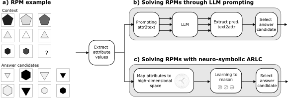

# I-RAVEN-X

This repository contains the generation of the I-RAVEN-X dataset as well as the LLM and LRM experiments of the two papers:
### Giacomo Camposampiero*, Michael Hersche*, Roger Wattenhofer, Abu Sebastian and Abbas Rahimi, "Can Large Reasoning Models do Analogical Reasoning under Perceptual Uncertainty?" [[Preprint]](https://arxiv.org/abs/2503.11207)
### Michael Hersche, Giacomo Camposampiero, Roger Wattenhofer, Abu Sebastian and Abbas Rahimi, "Towards Learning to Reason: Comparing LLMs with Neuro-Symbolic on Arithmetic Relations in Abstract Reasoning" [[NEURMAD workshop at AAAI'2025]](https://openreview.net/pdf?id=F90YO0MacL)


<div align="center">
  
</div>

 Please refer to the [ARLC codebase](https://github.com/IBM/abductive-rule-learner-with-context-awareness) for the NeSy experiments on I-RAVEN and I-RAVEN-X.

## Build the Environment 🛠️

#### Hardware
You will need a machine with a CUDA-enabled GPU and the Nvidia SDK installed to compile the CUDA kernels. We tested our methods on a compute node with two NVIDA Tesla A100 GPUs with CUDA Version 12.1.

#### Installing Dependencies

The `micromamba` software is required for running the code. You can create a new micromamba environment using

```bash
micromamba create --name rpmllm python=3.10
micromamba activate rpmllm
```

To install PyTorch 2.3 and CUDA, use
```bash
micromamba install pytorch==2.3.1 torchvision==0.18.1 torchaudio==2.3.1 pytorch-cuda=12.1 -c pytorch -c nvidia
```


Finally, install the requirements of this repo
```bash
pip install -r requirements.txt
pre-commit install
```

We suggest to format the code of the entire repository to improve its readability.
To do so, please install and run `black`
```bash
pip install black
black raven-with-large-language-models/
```


#### I-RAVEN and I-RAVEN-X Dataset
You can find the instructions to download and pre-process the data in the `src/data` folder.


## Run our Experiments 🔬
You can replicate the main experiments shown in the paper with the following scripts. For the GPT experiments, you have to add your OpenAI API keys to the files in `configs/models/gpt/*.yml`. Moreover, DeepSeek-R1 experiments are ran through the [together.AI}(https://www.together.ai/) API. You have to add your together.AI API keys to the files in `configs/models/deepseek/*.yml`.

### Experiments for replicating the NEURMAD paper (only LLMs and no perceptual uncertainty)
```bash
# GPT-4 on I-RAVEN
python main.py --data-cfg configs/datasets/iraven.yml --model-cfg configs/models/gpt/1_gpt4_iraven.yml

# LLama-3 on I-RAVEN
python main.py --data-cfg configs/datasets/iraven.yml --model-cfg configs/models/llama/1_llama_iraven.yml

# GPT-4 on I-RAVEN-X
python main.py --data-cfg configs/datasets/iravenx.yml --model-cfg configs/models/gpt/2_gpt4_iravenx.yml

# LLama-3 on I-RAVEN-X
python main.py --data-cfg configs/datasets/iravenx.yml --model-cfg configs/models/llama/2_llama_iravenx.yml
```

### Experiments for testing I-RAVEN-X with uncertainty on LRMs
```bash
# o3-mini on I-RAVEN-X with 10 confounders
python main.py --data-cfg configs/datasets/iravenx.yml --model-cfg configs/models/gpt/3_o3_mini_iravenx_10conf.yml

# o3-mini on I-RAVEN-X with smoothened distribution (0.51)
python main.py --data-cfg configs/datasets/iravenx.yml --model-cfg configs/models/gpt/4_o3_mini_iravenx_uncert_051.yml

# o3-mini on I-RAVEN-X with 10 confounders and smoothened distribution (0.51)
python main.py --data-cfg configs/datasets/iravenx.yml --model-cfg configs/models/gpt/5_o3_mini_iravenx_10conf_uncert_051.yml

# Deepseek-R1 on I-RAVEN-X with 10 confounders
python main.py --data-cfg configs/datasets/iravenx.yml --model-cfg configs/models/deepseek/3_r1_iravenx_10conf.yml

# Deepseek-R1 on I-RAVEN-X with smoothened distribution (0.51)
python main.py --data-cfg configs/datasets/iravenx.yml --model-cfg configs/models/deepseek/4_r1_iravenx_uncert_051.yml

# Deepseek-R1 on I-RAVEN-X with 10 confounders and smoothened distribution (0.51)
python main.py --data-cfg configs/datasets/iravenx.yml --model-cfg configs/models/deepseek/5_r1_iravenx_10conf_uncert_051.yml
```

## Citation 📚
If you use the work released here for your research, please consider citing our papers:
```
@article{camposampiero2025_lrm_uncertainty,
  title={Can Large Reasoning Models do Analogical Reasoning under Perceptual Uncertainty?},
  author={Camposampiero, Giacomo and Hersche, Michael and Wattenhofer, Roger and Sebastian, Abu and Rahimi, Abbas},
  journal={arXiv preprint arXiv:2503.11207},
  year={2025}
}

@inproceedings{hersche2025_rpm_llm_nesy,
  title = {Towards {Learning} to {Reason}: {Comparing} {LLMs} with {Neuro}-{Symbolic} on {Arithmetic} {Relations} in {Abstract} {Reasoning}},
  author={Hersche, Michael and Camposampiero, Giacomo and Wattenhofer, Roger and Sebastian, Abu and Rahimi, Abbas},
  booktitle = {{AAAI} {Workshop} on {Neural} {Reasoning} and {Mathematical} {Discovery} -- {An} {Interdisciplinary} {Two}-{Way} {Street} ({NEURMAD})},
  year={2025}
}
```


## License 🔏
Please refer to the LICENSE file for the licensing of our code. Our implementation relies on [In-Context Analgoical Reasoning with Pre-Trained Language Models](https://github.com/hxiaoyang/lm-raven) distributed under the MIT license.
